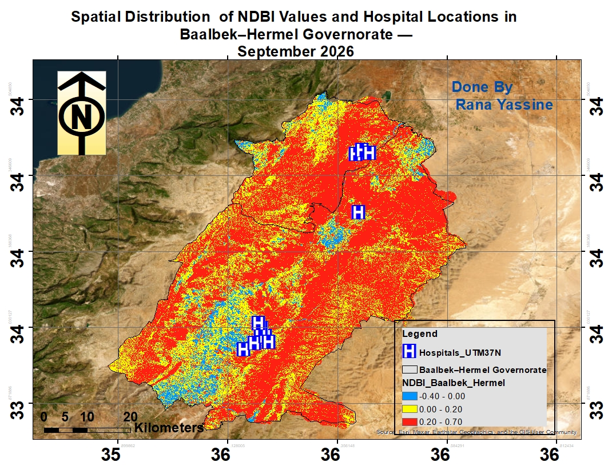
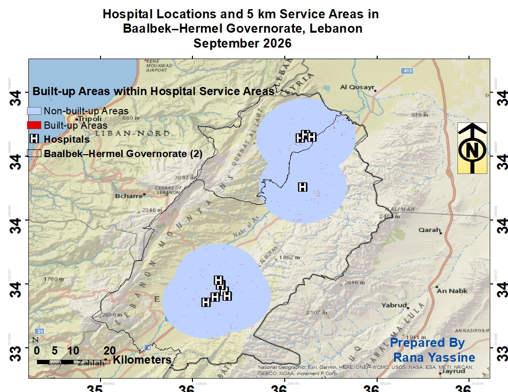
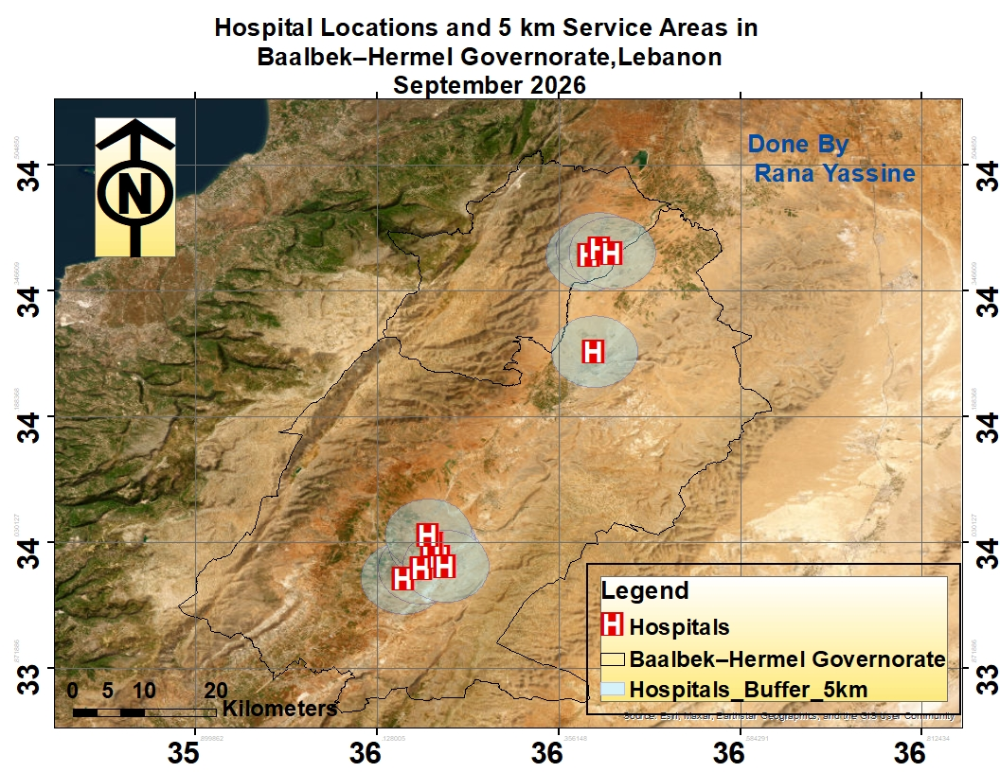
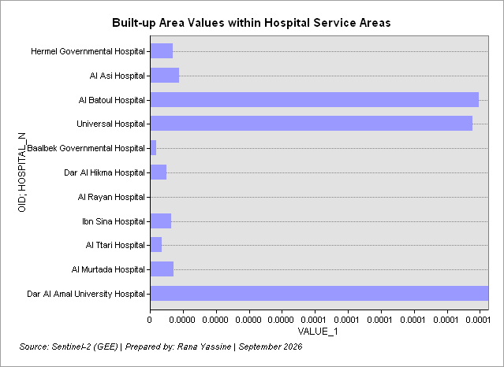

# Spatial Accessibility to Hospitals in Baalbek–Hermel Governorate, Lebanon

## NDBI and Hospital Locations

This map shows the spatial distribution of NDBI values and hospital locations in Baalbek–Hermel Governorate.

## Built-up Areas within Hospital Service Areas

This map shows the built-up areas located within the hospital service areas.

## Hospital Locations and 5 km Service Areas

This map shows hospital locations and the 5 km service areas around them.

## Built-up Area Values by Hospital

This graph compares the built-up area values for the hospitals.

## Methods

The analysis used Sentinel-2 imagery, NDBI, ArcMap, hospital locations, and 5 km buffer analysis.

**Prepared by:** Rana Yassine  
**Date:** September 2026
